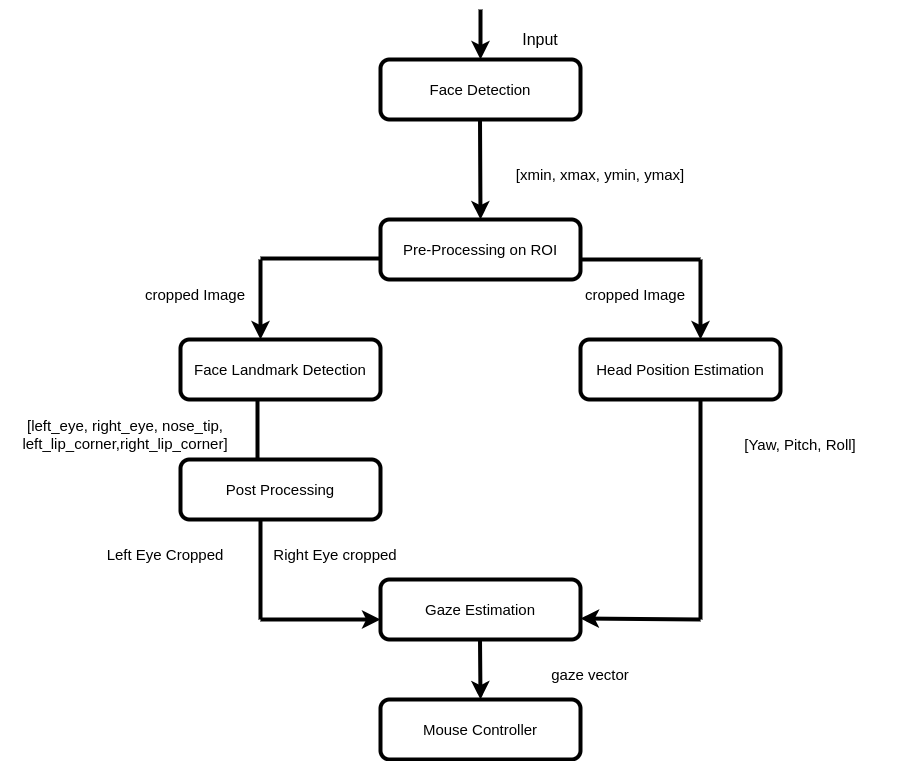

# Computer Pointer Controller

## Introduction
Computer Pointer Controller app is used to controll the movement of mouse pointer by the direction of eyes and also estimated pose of head. This app takes video as input and then app estimates eye-direction and head-pose and based on that estimation it move the mouse pointers.

## Project Set Up and Installation
### Pipeline

- The flow of data will look like this
    

### Project structure
```    .
    ├── src                     # contains all the core components face, gaze, headpose, landmarks, input_feeder, helper and mouse_controller
    ├── images                  # supported images for README.adoc
    ├── bin                     # Demo video's
    ├── intel                   # contains all the models for the project
    └── README.md               # Contains project write and/or documentation
 ```  

#### Models

Download the following models and place them into intel folder using openVINO model downloader:-

**1. Face Detection Model**
```
python /opt/intel/openvino/deployment_tools/tools/model_downloader/downloader.py --name "face-detection-adas-binary-0001"
```
**2. Facial Landmarks Detection Model**
```
python /opt/intel/openvino/deployment_tools/tools/model_downloader/downloader.py --name "landmarks-regression-retail-0009"
```
**3. Head Pose Estimation Model**
```
python /opt/intel/openvino/deployment_tools/tools/model_downloader/downloader.py --name "head-pose-estimation-adas-0001"
```
**4. Gaze Estimation Model**
```
python /opt/intel/openvino/deployment_tools/tools/model_downloader/downloader.py --name "gaze-estimation-adas-0002"
```
### Project dependencies
install the following dependencies to run the project for windows 10
1. [Install the Intel® Distribution of OpenVINO™ toolkit core components](https://docs.openvinotoolkit.org/2020.3/_docs_install_guides_installing_openvino_windows.html#Install-Core-Components)
2. Install the dependencies:
 **[Microsoft Visual Studio* with C++ 2019 with MSBuild](http://visualstudio.microsoft.com/downloads/) <br>
 **[CMake 3.14. 64-bit](https://cmake.org/download/) <br>
 **[Python 3.6.5 64-bit](https://www.python.org/downloads/release/python-365/)

## Demo
### Running the project

Open a new terminal and run the following commands:-

**1. CD into the directory of the project repository**
```
cd <project-repo-path>
```
**3. Initialize OpenVino environment from your local machine
```
C:\Program Files (x86)\IntelSWTools\openvino\bin\
setupvars.bat
```
**3. Run the main.py file**
```
python src/main.py -i bin/demo.mp4 -fd intel/face-detection-adas-binary-0001/FP32-INT1/face-detection-adas-binary-0001.xml -hp intel/head-pose-estimation-adas-0001/FP32/head-pose-estimation-adas-0001.xml -fl intel/landmarks-regression-retail-0009/FP32/landmarks-regression-retail-0009.xml -ge intel/gaze-estimation-adas-0002/FP32/gaze-estimation-adas-0002.xml
 
```
## Documentation
### Command Line Options
```
   1. -fd FACE_DETECTION_MODEL, --face_detection_model FACE_DETECTION_MODEL
                            specify the Path to Face Detection model xml file
    2. -fl FACIAL_LANDMARK_MODEL, --facial_landmark_model FACIAL_LANDMARK_MODEL
                            specify the Path to Facial Landmarks Detection model
                            xml file
    3. -hp HEAD_POSE_MODEL, --head_pose_model HEAD_POSE_MODEL
                            specify the Path to Head Pose Estimation model xml
                            file
    4. -ge GAZE_ESTIMATION_MODEL, --gaze_estimation_model GAZE_ESTIMATION_MODEL
                            specify the Path to Gaze Estimation model xml file
    5. -i INPUT, --input INPUT, specify input, use media file or type cam to use your
                            webcam
```
### optional arguments:
```
    1. -h, --help            show this help message and exit
    2. -d DEVICE, --device DEVICE
                            specify the target device to run inference on: CPU,
                            GPU, FPGA or MYRIAD (for NCS2)
    3. -pt PROB_THRESHOLD, --prob_threshold PROB_THRESHOLD
                            specify probability threshold for model to detect the
                            face accurately from the frame
    4. -x EXTENSION, --extension EXTENSION
                            specify path to CPU extension file, if applicable, for
                            OpenVINO version < 2020
    5. -sh SHOW_OUTPUT, --show_output SHOW_OUTPUT
                            specify whether to Show Visualization of output
                            results for a model e.g: 'fd fl ge' or use 'all'
   ```            

## Benchmarks
I have Measured the performance of the app using multiple model precisions on  Intel® Celeron N2840 hardware as outlined below
Note: fd=face detection model, fl=facial landmarks model, hp=head pose estimation model and ge=gaze estimation model
```
MODELS: fd, fl, hp, ge :  FP32-INT1 FP32 FP32 FP32

models loading time  :  0.45
frames per seconds   :  12.5
total inference time :  7.21

MODELS: fd, fl, hp, ge :  FP32-INT1 FP16 FP32 FP32

models loading time  :  0.40
frames per seconds   :  17.43
total inference time :  4.02

MODELS: fd, fl, hp, ge :  FP32-INT1 FP16 FP16 FP32

models loading time  :  0.50
frames per seconds   :  8.16
total inference time :  8.43

MODELS: fd, fl, hp, ge :  FP32-INT1 FP16 FP16 FP16

models loading time  :  0.41
frames per seconds   :  12.45
total inference time :  4.11

MODELS: fd, fl, hp, ge :  FP32-INT1 FP32-INT8 FP32 FP32

models loading time  :  0.53
frames per seconds   :  8.41
total inference time :  6.63
```

## Results
I have run the model in 2 diffrent hardware:-
1. Intel Celeron N2840 CPU 
2. Intel Celeron N2840 GPU

GPU proccesed more frames per second compared to any other hardware using FP16 because the GPU has severals Execution units with instruction sets of 16bit floating point data types.

From the result in the inference time, frame per second and model loading time of the benchmark, the best precision combination is "FP32-INT1 FP16 FP16 FP16". FP32-INT1 will be used for face detection model while FP16 will be used for other models. by doing this we will maintain our system resources while having a good accuracy that is enough.


## Stand Out Suggestions


### Edge Cases
There will be certain situations that will break your inference flow. For instance, lighting changes or multiple people in the frame. Explain some of the edge cases you encountered in your project and how you solved them to make your project more robust.

- If the model can not detect a face it prints unable to detect a face and skip to another frame untill  a face is detected

- if the face is not detected either due to low light or other situations, the app output log info in terminal telling the user: No face detected and skip the frame.

- if more than one face is detected in the frame, it will show a log warning in terminal and tell the user only one face will be used.
